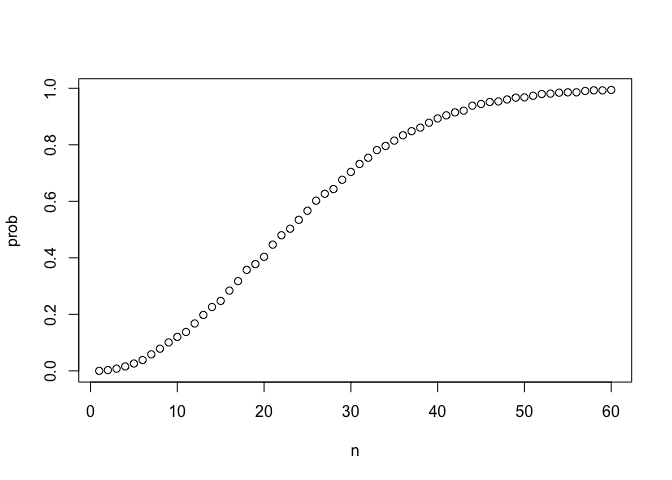
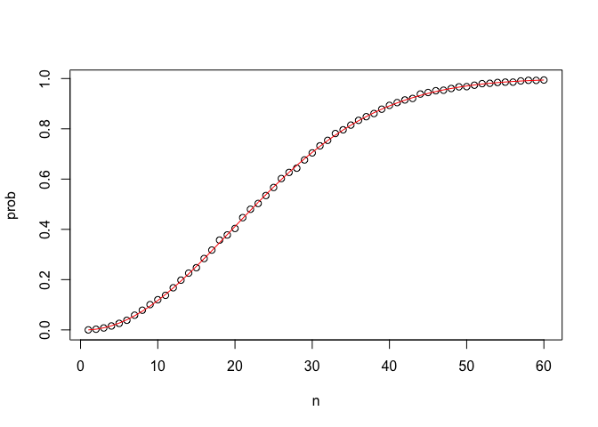
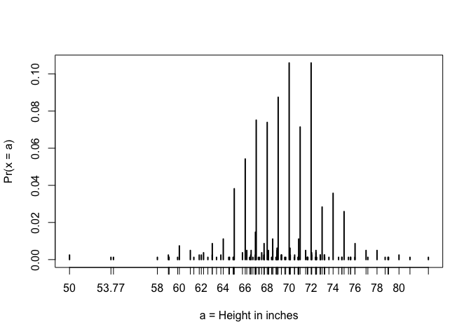

Section 3 - 1.1 Discreet Probability
================
M Sadman Sakib

First, set the seed. This is very important to reproduce the results in
this markdown.

``` r
set.seed(1986, sample.kind="Rounding")
```

    ## Warning in set.seed(1986, sample.kind = "Rounding"): non-uniform 'Rounding'
    ## sampler used

# We can use `mean()` function to calculate probabilities

For example, say we have 2 red and 3 blue beads in an urn.

``` r
beads <- rep(c("red", "blue"), times = c(2,3))
beads
```

    ## [1] "red"  "red"  "blue" "blue" "blue"

*Q: What is the probability to pick out blue beads?*

``` r
mean(beads == "blue")
```

    ## [1] 0.6

Therefore, mean() of a logical vector(beads == “blue”) is giving out the
probability of picking up a blue bead from the urn.

### Assessment:

**Probability of cyan**

1- One ball will be drawn at random from a box containing: 3 cyan balls,
5 magenta balls, and 7 yellow balls. Calculate probability of picking
and not picking cyan balls.

``` r
beads <- rep(c("cyan", "magenta", "yellow"), times = c(3,5,7))
beads
```

    ##  [1] "cyan"    "cyan"    "cyan"    "magenta" "magenta" "magenta" "magenta"
    ##  [8] "magenta" "yellow"  "yellow"  "yellow"  "yellow"  "yellow"  "yellow" 
    ## [15] "yellow"

``` r
A = mean(beads =="cyan")
B = mean(beads !="cyan")
paste0("probabiliy of picking cyan:", A)
```

    ## [1] "probabiliy of picking cyan:0.2"

``` r
paste0("probability of not picking cyan:", B)
```

    ## [1] "probability of not picking cyan:0.8"

2- Instead of taking just one draw, consider taking two draws. You take
the second draw without returning the first draw to the box.

We call this **sampling without replacement**. What is the probability
that the first draw is cyan and that the second draw is not cyan?

*A:* need to multiply correctly of those two probabilities above.

``` r
first.draw.cyan = 3/(3+5+7)
second.draw.not.cyan = 1 - (2/(2+5+7))
probability = first.draw.cyan * second.draw.not.cyan
paste0("probability (without replacement):",probability)
```

    ## [1] "probability (without replacement):0.171428571428571"

3- Now repeat the experiment, but this time, after taking the first draw
and recording the color, return it back to the box and shake the box. We
call this sampling with replacement.

What is the probability that the first draw is cyan and that the second
draw is not cyan?

``` r
first.draw.cyan = 3/(3+5+7)
second.draw.not.cyan = 1 - (3/(3+5+7))
probability = first.draw.cyan * second.draw.not.cyan
paste0("probability (with replacement):",probability)
```

    ## [1] "probability (with replacement):0.16"

Bonus:

-   `prop.table()` returns proportions.

# **Now, Combinations and Permutations**

## Introducing paste() and expand.grid()

``` r
# joining strings with paste
number <- "Three"
suit <- "Hearts"
paste(number, suit)
```

    ## [1] "Three Hearts"

``` r
# joining vectors element-wise with paste
paste(letters[1:5], as.character(1:5))
```

    ## [1] "a 1" "b 2" "c 3" "d 4" "e 5"

``` r
# generating combinations of 2 vectors with expand.grid
expand.grid(pants = c("blue", "black"), shirt = c("white", "grey", "plaid"))
```

    ##   pants shirt
    ## 1  blue white
    ## 2 black white
    ## 3  blue  grey
    ## 4 black  grey
    ## 5  blue plaid
    ## 6 black plaid

## Generating a deck of cards

``` r
suits <- c("Diamonds", "Clubs", "Hearts", "Spades")
numbers <- c("Ace", "Deuce", "Three", "Four", "Five", "Six", "Seven", "Eight", "Nine", "Ten", "Jack", "Queen", "King")
deck <- expand.grid(number = numbers, suit = suits)
deck <- paste(deck$number, deck$suit)

# probability of drawing a king
kings <- paste("King", suits)
mean(deck %in% kings)
```

    ## [1] 0.07692308

\#\#Permutations and combinations

``` r
library(gtools)
permutations(5,2)    # ways to choose 2 numbers in order from 1:5
```

    ##       [,1] [,2]
    ##  [1,]    1    2
    ##  [2,]    1    3
    ##  [3,]    1    4
    ##  [4,]    1    5
    ##  [5,]    2    1
    ##  [6,]    2    3
    ##  [7,]    2    4
    ##  [8,]    2    5
    ##  [9,]    3    1
    ## [10,]    3    2
    ## [11,]    3    4
    ## [12,]    3    5
    ## [13,]    4    1
    ## [14,]    4    2
    ## [15,]    4    3
    ## [16,]    4    5
    ## [17,]    5    1
    ## [18,]    5    2
    ## [19,]    5    3
    ## [20,]    5    4

``` r
all_phone_numbers <- permutations(10, 7, v = 0:9)
n <- nrow(all_phone_numbers)
index <- sample(n, 5)
all_phone_numbers[index,]
```

    ##      [,1] [,2] [,3] [,4] [,5] [,6] [,7]
    ## [1,]    4    8    2    7    0    3    1
    ## [2,]    2    0    8    7    3    4    6
    ## [3,]    6    0    9    3    7    2    1
    ## [4,]    3    2    8    4    7    1    6
    ## [5,]    5    9    8    7    3    6    0

``` r
permutations(3,2)    # order matters
```

    ##      [,1] [,2]
    ## [1,]    1    2
    ## [2,]    1    3
    ## [3,]    2    1
    ## [4,]    2    3
    ## [5,]    3    1
    ## [6,]    3    2

``` r
combinations(3,2)    # order does not matter
```

    ##      [,1] [,2]
    ## [1,]    1    2
    ## [2,]    1    3
    ## [3,]    2    3

## Probability of drawing a second king given that one king is drawn

``` r
hands <- permutations(52,2, v = deck)
first_card <- hands[,1]
second_card <- hands[,2]
sum(first_card %in% kings)
```

    ## [1] 204

``` r
sum(first_card %in% kings & second_card %in% kings) / sum(first_card %in% kings)
```

    ## [1] 0.05882353

## Probability of a natural 21 in blackjack

``` r
aces <- paste("Ace", suits)
facecard <- c("King", "Queen", "Jack", "Ten")
facecard <- expand.grid(number = facecard, suit = suits)
facecard <- paste(facecard$number, facecard$suit)

hands <- combinations(52, 2, v=deck) # all possible hands

# probability of a natural 21 given that the ace is listed first in `combinations`
mean(hands[,1] %in% aces & hands[,2] %in% facecard)
```

    ## [1] 0.04826546

``` r
# probability of a natural 21 checking for both ace first and ace second
mean((hands[,1] %in% aces & hands[,2] %in% facecard)|(hands[,2] %in% aces & hands[,1] %in% facecard))
```

    ## [1] 0.04826546

## Monte Carlo simulation of natural 21 in blackjack

``` r
# code for one hand of blackjack
hand <- sample(deck, 2)
hand
```

    ## [1] "Nine Hearts"   "Nine Diamonds"

``` r
# code for B=10,000 hands of blackjack
B <- 10000
results <- replicate(B, {
    hand <- sample(deck, 2)
    (hand[1] %in% aces & hand[2] %in% facecard) | (hand[2] %in% aces & hand[1] %in% facecard)
})
mean(results)
```

    ## [1] 0.0464

## The birthday problem

-   `duplicated()` takes a vector and returns a vector of the same
    length with TRUE for any elements that have appeared previously in
    that vector.
-   We can compute the probability of shared birthdays in a group of
    people by modeling birthdays as random draws from the numbers 1
    through 365. We can then use this sampling model of birthdays to run
    a Monte Carlo simulation to estimate the probability of shared
    birthdays.

``` r
# checking for duplicated bdays in one 50 person group
n <- 50
bdays <- sample(1:365, n, replace = TRUE)    # generate n random birthdays
any(duplicated(bdays))    # check if any birthdays are duplicated
```

    ## [1] TRUE

``` r
# Monte Carlo simulation with B=10000 replicates
B <- 10000
results <- replicate(B, {    # returns vector of B logical values
    bdays <- sample(1:365, n, replace = TRUE)
    any(duplicated(bdays))
})
mean(results)    # calculates proportion of groups with duplicated bdays
```

    ## [1] 0.9702

# Lets learn `sapply()`

# Function for birthday problem Monte Carlo simulations

``` r
# function to calculate probability of shared bdays across n people
compute_prob <- function(n, B = 10000) {
    same_day <- replicate(B, {
        bdays <- sample(1:365, n, replace = TRUE)
        any(duplicated(bdays))
    })
    mean(same_day)
}

n <- seq(1, 60)
```

Element-wise operation over vectors and sapply

``` r
x <- 1:10
sqrt(x)    # sqrt operates on each element of the vector
```

    ##  [1] 1.000000 1.414214 1.732051 2.000000 2.236068 2.449490 2.645751 2.828427
    ##  [9] 3.000000 3.162278

``` r
y <- 1:10
x*y    # * operates element-wise on both vectors
```

    ##  [1]   1   4   9  16  25  36  49  64  81 100

``` r
compute_prob(n)    # does not iterate over the vector n without sapply
```

    ## [1] 0

``` r
x <- 1:10
sapply(x, sqrt)    # this is equivalent to sqrt(x)
```

    ##  [1] 1.000000 1.414214 1.732051 2.000000 2.236068 2.449490 2.645751 2.828427
    ##  [9] 3.000000 3.162278

``` r
prob <- sapply(n, compute_prob)    # element-wise application of compute_prob to n
plot(n, prob)
```

<!-- -->
\# Finally, computing birthday problem probabilities with sapply

``` r
# function for computing exact probability of shared birthdays for any n
exact_prob <- function(n){
    prob_unique <- seq(365, 365-n+1)/365   # vector of fractions for mult. rule
    1 - prod(prob_unique)    # calculate prob of no shared birthdays and subtract from 1
}

# applying function element-wise to vector of n values
eprob <- sapply(n, exact_prob)

# plotting Monte Carlo results and exact probabilities on same graph
plot(n, prob)    # plot Monte Carlo results
lines(n, eprob, col = "red")    # add line for exact prob
```

<!-- -->

# How Many Monte Carlo Experiments are Enough?

-   Estimating a practical value of B This code runs Monte Carlo
    simulations to estimate the probability of shared birthdays using
    several B values and plots the results. When B is large enough that
    the estimated probability stays stable, then we have selected a
    useful value of B.

``` r
B <- 10^seq(1, 5, len = 100)    # defines vector of many B values
compute_prob <- function(B, n = 22){    # function to run Monte Carlo simulation with each B
    same_day <- replicate(B, {
        bdays <- sample(1:365, n, replace = TRUE)
        any(duplicated(bdays))
    })
    mean(same_day)
}

prob <- sapply(B, compute_prob)    # apply compute_prob to many values of B
plot(log10(B), prob, type = "l")    # plot a line graph of estimates 
```

<!-- -->
This clearly shows, the bigger the value, the better the probability
estimation. B = 1000, the curve gets stable enough. But the higher the
value is , the better.

# Exercise time!

Say you’ve drawn 5 balls from the a box that has 3 cyan balls, 5 magenta
balls, and 7 yellow balls, with replacement, and all have been yellow.

What is the probability that the next one is yellow?

``` r
cyan <- 3
magenta <- 5
yellow <- 7

# Assign the variable 'p_yellow' as the probability that a yellow ball is drawn from the box.
p_yellow = yellow/(cyan+magenta+yellow)
# Using the variable 'p_yellow', calculate the probability of drawing a yellow ball on the sixth draw. Print this value to the console.
p_yellow
```

    ## [1] 0.4666667

Exercise. Rolling a die If you roll a 6-sided die once, what is the
probability of not seeing a 6? If you roll a 6-sided die six times, what
is the probability of not seeing a 6 on any of those rolls?

``` r
# Assign the variable 'p_no6' as the probability of not seeing a 6 on a single roll.
p_no6 = 1 - (1/6)

# Calculate the probability of not seeing a 6 on six rolls using `p_no6`. Print your result to the console: do not assign it to a variable.
p_no6^6
```

    ## [1] 0.334898

Monte Carlo simulation for Celtics winning a game Create a Monte Carlo
simulation to confirm your answer to the previous problem by estimating
how frequently the Celtics win at least 1 of 4 games. Use B &lt;- 10000
simulations.

The provided sample code simulates a single series of four random games,
simulated\_games.

``` r
# This line of example code simulates four independent random games where the Celtics either lose or win. Copy this example code to use within the `replicate` function.
simulated_games <- sample(c("lose","win"), 4, replace = TRUE, prob = c(0.6, 0.4))

# The variable 'B' specifies the number of times we want the simulation to run. Let's run the Monte Carlo simulation 10,000 times.
B <- 10000

# Use the `set.seed` function to make sure your answer matches the expected result after random sampling.
set.seed(1)

# Create an object called `celtic_wins` that replicates two steps for B iterations: (1) generating a random four-game series `simulated_games` using the example code, then (2) determining whether the simulated series contains at least one win for the Celtics. Put these steps on separate lines.
celtic_wins <- replicate(B, {
  simulated_games <- sample(c("lose","win"), 4, replace = TRUE, prob = c(0.6, 0.4))
  any(simulated_games=="win")
})

# Calculate the frequency out of B iterations that the Celtics won at least one game. Print your answer to the console. 
mean(celtic_wins)
```

    ## [1] 0.8757

# The Monty Hall Problem

Key points - Monte Carlo simulations can be used to simulate random
outcomes, which makes them useful when exploring ambiguous or less
intuitive problems like the Monty Hall problem. - In the Monty Hall
problem, contestants choose one of three doors that may contain a prize.
Then, one of the doors that was not chosen by the contestant and does
not contain a prize is revealed. The contestant can then choose whether
to stick with the original choice or switch to the remaining unopened
door. - Although it may seem intuitively like the contestant has a 1 in
2 chance of winning regardless of whether they stick or switch, Monte
Carlo simulations demonstrate that the actual probability of winning is
1 in 3 with the stick strategy and 2 in 3 with the switch strategy.

So, if you stick to the same door:

``` r
B <- 10000
stick <- replicate(B, {
    doors <- as.character(1:3)
    prize <- sample(c("car","goat","goat"))    # puts prizes in random order
    prize_door <- doors[prize == "car"]    # note which door has prize
    my_pick  <- sample(doors, 1)    # note which door is chosen
    show <- sample(doors[!doors %in% c(my_pick, prize_door)],1)    # open door with no prize that isn't chosen
    stick <- my_pick    # stick with original door
    stick == prize_door    # test whether the original door has the prize
})
mean(stick)    # probability of choosing prize door when sticking
```

    ## [1] 0.3231

So, if you switch to a different door:

``` r
switch <- replicate(B, {
    doors <- as.character(1:3)
    prize <- sample(c("car","goat","goat"))    # puts prizes in random order
    prize_door <- doors[prize == "car"]    # note which door has prize
    my_pick  <- sample(doors, 1)    # note which door is chosen first
    show <- sample(doors[!doors %in% c(my_pick, prize_door)], 1)    # open door with no prize that isn't chosen
    switch <- doors[!doors%in%c(my_pick, show)]    # switch to the door that wasn't chosen first or opened
    switch == prize_door    # test whether the switched door has the prize
})
mean(switch)    # probability of choosing prize door when switching
```

    ## [1] 0.6718

# Last assessments on Discreet probability

``` r
library(gtools)
library(tidyverse)
```

    ## Warning in (function (kind = NULL, normal.kind = NULL, sample.kind = NULL) :
    ## non-uniform 'Rounding' sampler used

    ## Warning in (function (kind = NULL, normal.kind = NULL, sample.kind = NULL) :
    ## non-uniform 'Rounding' sampler used

``` r
nrow(permutations(8,3))
```

    ## [1] 336

``` r
nrow(combinations(8,3))
```

    ## [1] 56

``` r
1/56 # 1 out of 56 possibility that all three medals won by jamaicans. 
```

    ## [1] 0.01785714

``` r
B = 10000
runners <- c("Jamaica", "Jamaica", "Jamaica", "USA", "Ecuador", "Netherlands", "France", "South Africa")  
          
set.seed(1)
jamaican.winners = replicate(B,{
            winners <- sample(runners, 3)
            winners[1] == "Jamaica" & winners[2] == "Jamaica" & winners[3] == "Jamaica"}
)
mean(jamaican.winners)
```

    ## [1] 0.0165

# Next assessment

A meal at the restaurant includes 1 entree, 2 sides, and 1 drink. He
currently offers a choice of 1 entree from a list of 6 options, a choice
of 2 different sides from a list of 6 options, and a choice of 1 drink
from a list of 2 options.

``` r
#How many meal combinations are possible with the current menu?
  6 * nrow(combinations(6,2)) * 2
```

    ## [1] 180

``` r
6 * nrow(combinations(6,2)) * 3
```

    ## [1] 270

``` r
6 * nrow(combinations(6,3)) * 3
```

    ## [1] 360

# Q: 2d

The manager is concerned that customers may not want 3 sides with their
meal. He is willing to increase the number of entree choices instead,
but if he adds too many expensive options it could eat into profits. He
wants to know how many entree choices he would have to offer in order to
meet his goal.

-   Write a function that takes a number of entree choices and returns
    the number of meal combinations possible given that number of entree
    options, 3 drink choices, and a selection of 2 sides from 6 options.

-   Use sapply() to apply the function to entree option counts ranging
    from 1 to 12.

What is the minimum number of entree options required in order to
generate more than 365 combinations?

``` r
meal.combination = function(entree.choice){
  nrow(combinations(entree.choice,1)) * nrow(combinations(6,2)) * 3
}

sapply(1:12, meal.combination)
```

    ##  [1]  45  90 135 180 225 270 315 360 405 450 495 540

``` r
meal.combination.sides = function(side.choice){
  nrow(combinations(6,1)) * nrow(combinations(side.choice,2)) * 3
}

sapply(2:12, meal.combination.sides)
```

    ##  [1]   18   54  108  180  270  378  504  648  810  990 1188

Q3,4 Case-control studies help determine whether certain exposures are
associated with outcomes such as developing cancer. The built-in dataset
esoph contains data from a case-control study in France comparing people
with esophageal cancer (cases, counted in ncases) to people without
esophageal cancer (controls, counted in ncontrols) that are carefully
matched on a variety of demographic and medical characteristics. The
study compares alcohol intake in grams per day (alcgp) and tobacco
intake in grams per day (tobgp) across cases and controls grouped by age
range (agegp).

The dataset is available in base R and can be called with the variable
name esoph:

``` r
library(tidyverse)
head(esoph)
```

    ##   agegp     alcgp    tobgp ncases ncontrols
    ## 1 25-34 0-39g/day 0-9g/day      0        40
    ## 2 25-34 0-39g/day    10-19      0        10
    ## 3 25-34 0-39g/day    20-29      0         6
    ## 4 25-34 0-39g/day      30+      0         5
    ## 5 25-34     40-79 0-9g/day      0        27
    ## 6 25-34     40-79    10-19      0         7

``` r
nrow(esoph)
```

    ## [1] 88

``` r
all_cases = sum(esoph$ncases)
all_controls = sum(esoph$ncontrols)

#What is the probability that a subject in the highest alcohol consumption group is a cancer case?
levels(esoph$alcgp)
```

    ## [1] "0-39g/day" "40-79"     "80-119"    "120+"

``` r
esoph %>% filter(alcgp == "120+") %>%
    select(ncases, ncontrols) %>%
    summarise(ncases_sum = sum(ncases), ncontrols_sum = sum(ncontrols), prob =ncases_sum / (ncases_sum+ncontrols_sum) ) 
```

    ##   ncases_sum ncontrols_sum      prob
    ## 1         45            22 0.6716418

``` r
esoph %>% filter(alcgp == "0-39g/day") %>%
    select(ncases, ncontrols) %>%
    summarise(ncases_sum = sum(ncases), ncontrols_sum = sum(ncontrols), prob =ncases_sum / (ncases_sum+ncontrols_sum) ) 
```

    ##   ncases_sum ncontrols_sum       prob
    ## 1         29           386 0.06987952

``` r
levels(esoph$tobgp)
```

    ## [1] "0-9g/day" "10-19"    "20-29"    "30+"

``` r
esoph %>% summarise(sum_cases = sum(ncases))
```

    ##   sum_cases
    ## 1       200

``` r
esoph %>%  filter(tobgp != "0-9g/day" ) %>% summarise(sum_cases_10above = sum(ncases))
```

    ##   sum_cases_10above
    ## 1               122

``` r
122/200
```

    ## [1] 0.61

``` r
esoph %>% summarise(sum_controls = sum(ncontrols))
```

    ##   sum_controls
    ## 1          775

``` r
esoph %>%  filter(tobgp != "0-9g/day" ) %>% summarise(sum_cases_10above = sum(ncontrols))
```

    ##   sum_cases_10above
    ## 1               328

``` r
328/775
```

    ## [1] 0.4232258

``` r
esoph %>%  filter(alcgp == "120+" ) %>% summarise(sum_cases_alcMax = sum(ncases)) %>% .$sum_cases_alcMax
```

    ## [1] 45

``` r
45
```

    ## [1] 45

``` r
45/(all_cases)
```

    ## [1] 0.225

``` r
x = esoph %>%  filter(tobgp == "30+" ) %>% pull(ncases) %>% sum()

x/all_cases
```

    ## [1] 0.155

``` r
x = esoph %>%  filter(tobgp == "30+" | alcgp == "120+" ) %>% pull(ncases) %>% sum()
x/all_cases
```

    ## [1] 0.33

``` r
x/all_controls
```

    ## [1] 0.08516129

``` r
esoph %>%  filter(alcgp == "120+" ) %>% summarise(ncases.sum = sum(ncases), ncontrols.sum = sum(ncontrols), ncases.prob = ncases.sum/all_cases,  ncontrols.prob = ncontrols.sum/all_controls,   ratio = ncases.prob/ncontrols.prob  )
```

    ##   ncases.sum ncontrols.sum ncases.prob ncontrols.prob    ratio
    ## 1         45            22       0.225      0.0283871 7.926136

``` r
x = esoph %>%  filter(tobgp == "30+" ) %>% pull(ncontrols) %>%  sum()
x/all_controls
```

    ## [1] 0.06580645

``` r
x = esoph %>%  filter(tobgp == "30+" & alcgp == "120+" ) %>% pull(ncontrols) %>%  sum()
x/all_controls
```

    ## [1] 0.003870968

``` r
x = esoph %>%  filter(tobgp == "30+" | alcgp == "120+" ) %>% pull(ncontrols) %>%  sum()
x/all_controls
```

    ## [1] 0.09032258

``` r
esoph %>%  filter(tobgp == "30+" | alcgp == "120+" ) %>% summarise(ncases.sum = sum(ncases), ncontrols.sum = sum(ncontrols), ncases.prob = ncases.sum/all_cases,  ncontrols.prob = ncontrols.sum/all_controls,   ratio = ncases.prob/ncontrols.prob  )
```

    ##   ncases.sum ncontrols.sum ncases.prob ncontrols.prob    ratio
    ## 1         66            70        0.33     0.09032258 3.653571

\#\#Now, Continuous probabiliy: Using pnorm() to calculate probabilities

``` r
#Given male heights x:
library(tidyverse)
library(dslabs)
data(heights)
x <- heights %>% filter(sex=="Male") %>% pull(height)

#We can estimate the probability that a male is taller than 70.5 inches using:

1 - pnorm(70.5, mean(x), sd(x))
```

    ## [1] 0.371369

# Discretization and the normal approximation

``` r
# plot distribution of exact heights in data
plot(prop.table(table(x)), xlab = "a = Height in inches", ylab = "Pr(x = a)")
```

<!-- -->

``` r
# probabilities in actual data over length 1 ranges containing an integer
mean(x <= 68.5) - mean(x <= 67.5)
```

    ## [1] 0.114532

``` r
mean(x <= 69.5) - mean(x <= 68.5)
```

    ## [1] 0.1194581

``` r
mean(x <= 70.5) - mean(x <= 69.5)
```

    ## [1] 0.1219212

``` r
# probabilities in normal approximation match well
pnorm(68.5, mean(x), sd(x)) - pnorm(67.5, mean(x), sd(x))
```

    ## [1] 0.1031077

``` r
pnorm(69.5, mean(x), sd(x)) - pnorm(68.5, mean(x), sd(x))
```

    ## [1] 0.1097121

``` r
pnorm(70.5, mean(x), sd(x)) - pnorm(69.5, mean(x), sd(x))
```

    ## [1] 0.1081743

``` r
# probabilities in actual data over other ranges don't match normal approx as well
mean(x <= 70.9) - mean(x <= 70.1)
```

    ## [1] 0.02216749

``` r
pnorm(70.9, mean(x), sd(x)) - pnorm(70.1, mean(x), sd(x))
```

    ## [1] 0.08359562
